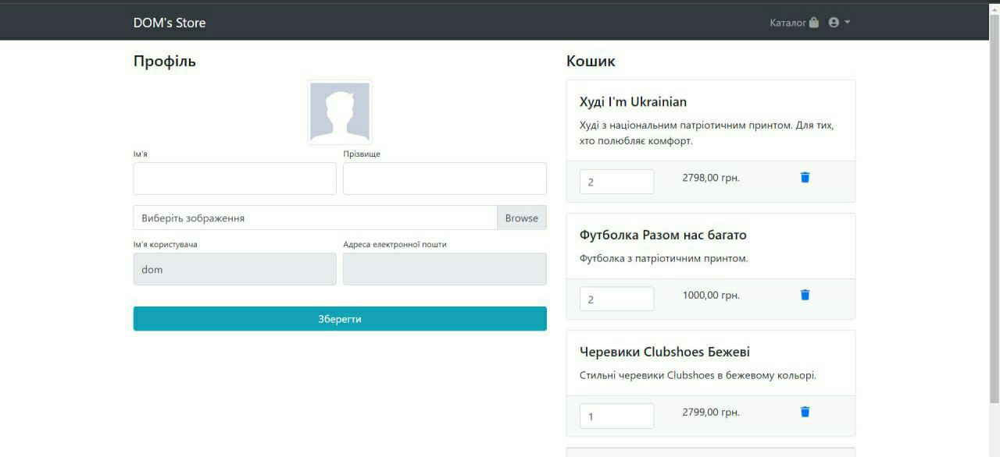

# Store project

My diploma project

## Check it out!

[Store project deployed to Render] (PASTE_LINK_HERE)

## Installation

Python3 must be already installed

***
* git clone https://github.com/NeighborDOM/django_store
* cd django-store
* python3 -m venv venv
* sourse venv/bin/activate
* pip install -r requirements.txt
* puthon manage.py runserver #starts Django Server
***

## Features

* Autentification functionality for User
* Purchase management from website interface
* Powerful admin panel for advanced managing

## Demo

